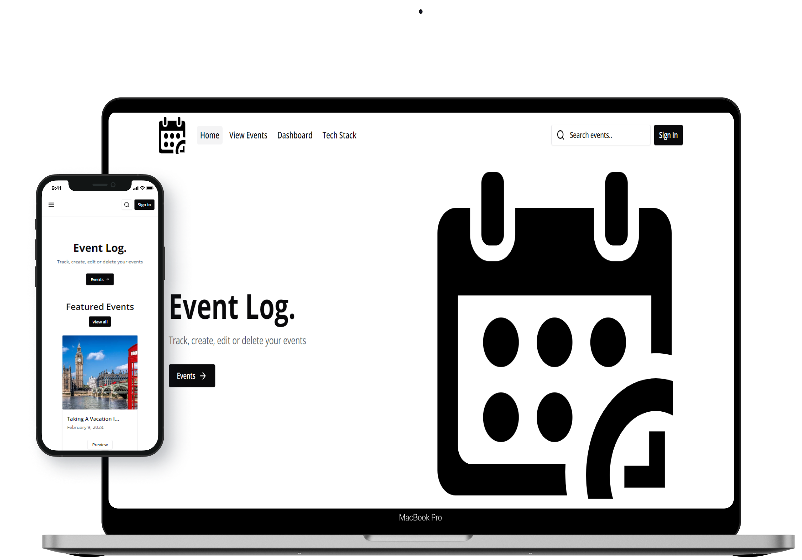
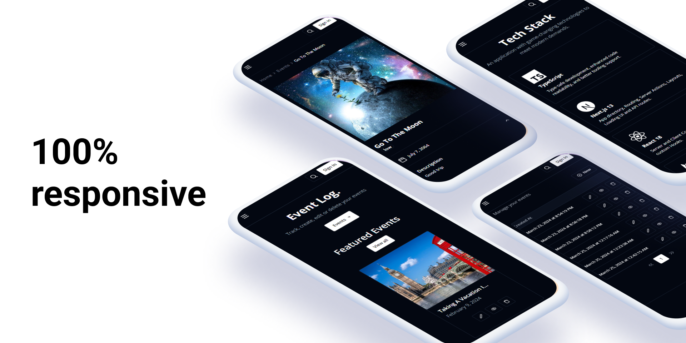
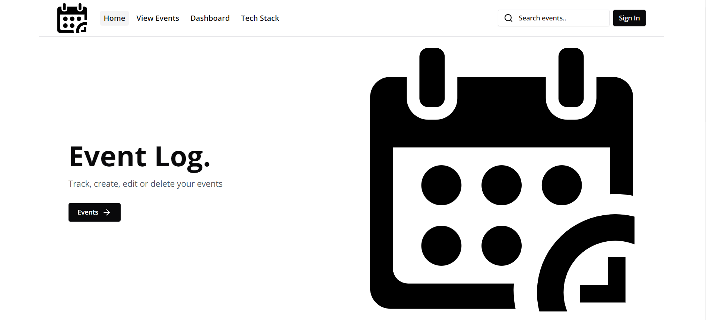
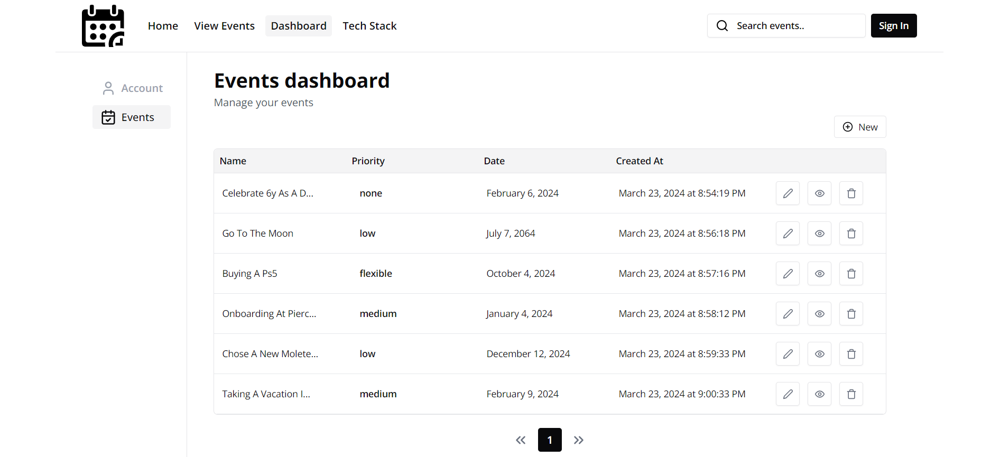
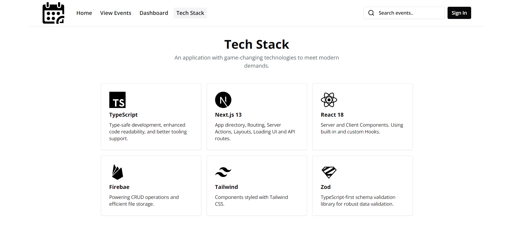

# [Event log]("https://pierce-event-log.vercel.app/")


Project built with the new Next.js App Router, React 18, TypeScript, Tailwind and Firebase.

[](https://pierce-event-log.vercel.app/)
[](https://pierce-event-log.vercel.app/)

<details>
  <summary>See more screens here</summary>
  
  [](https://pierce-event-log.vercel.app/)
  [](https://pierce-event-log.vercel.app/)
  [](https://pierce-event-log.vercel.app/)
  [](https://pierce-event-log.vercel.app/)
  

</details>

## Features

- Next.js new `/app` directory
- Server and Client Components
- Routing, Pages, Layouts and Layout Groups
- Data Fetching, Revalidating, Caching
- Route handlers
- Suspense Boundaries, Loading UI and Not found pages
- Static and Dynamic Metadatas
- Pagination, Search, Sorting, Filters
- CRUD operations + Dashboard table
- Database and storage on **Firebase**
- Image uploads with dropzone provided by **react-drop-zone**
- Notification messages with **react-hot-toast**
- Building forms with **react-hook-form** and validations using **Zod**
- Global State management with **Zustand**
- Written in **TypeScript**
- Components styled with **Tailwind CSS**
- Dark/light mode with **next-themes**
- Available Progressive Web App (**PWA**)

## Run it on your machine

1. Clone the repository

```bash
git clone https://github.com/helton-quintans/event-log.git
```

2. Install dependencies using pnpm

```bash
pnpm install
```

3. Copy the `.env.example` to `.env` and update the variables

```bash
cp .env.example .env
```

4. Start the development server

```bash
pnpm run dev
```

## Acknowledgements

- Skateshop13 [Skateshop13 repository](https://github.com/sadmann7/skateshop) for design inspirations
